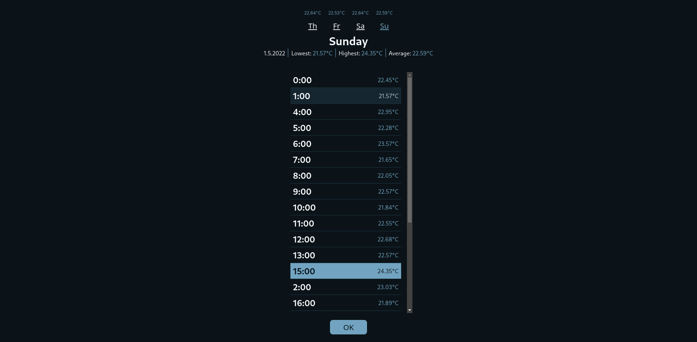

# Weather app

**Web app for my weather app**

<strong>Showcase</strong>

Main

Menu

## Tech info

Using svelte + typescript + scss

## Links

[weather_app_server](https://github.com/MichalUSER/weather_app_server)
— [weather_app_client](https://github.com/MichalUSER/weather_app_client)
— [weather_app_cli](https://github.com/MichalUSER/weather_app_cli)

